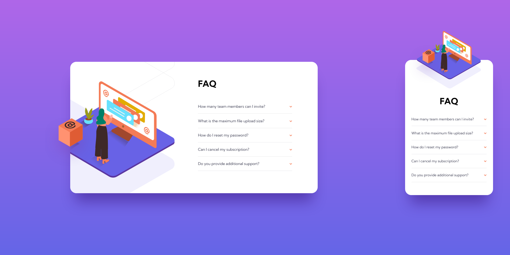

# Frontend Mentor - FAQ accordion card solution

This is a solution to the [FAQ accordion card challenge on Frontend Mentor](https://www.frontendmentor.io/challenges/faq-accordion-card-XlyjD0Oam). Frontend Mentor challenges help you improve your coding skills by building realistic projects. 

## Table of contents

- [Overview](#overview)
  - [The challenge](#the-challenge)
  - [Screenshot](#screenshot)
  - [Links](#links)
- [My process](#my-process)
  - [Built with](#built-with)
  - [What I learned](#what-i-learned)
  - [Continued development](#continued-development)
  - [Useful resources](#useful-resources)
- [Author](#author)

## Overview

### The challenge

Users should be able to:

- View the optimal layout for the component depending on their device's screen size
- See hover states for all interactive elements on the page
- Hide/Show the answer to a question when the question is clicked

### Screenshot

### Links

- Solution URL: [https://github.com/LuisCBeltran/faq-accordion-card-main](https://github.com/LuisCBeltran/faq-accordion-card-main)
- Live Site URL: [https://luiscbeltran.github.io/faq-accordion-card-main/](https://luiscbeltran.github.io/faq-accordion-card-main/)

## My process

### Built with

- Semantic HTML5 markup
- CSS
- Flexbox
- CSS Grid
- Mobile-first workflow

### What I learned

I learnt how to use pure CSS to make an accordion. I also improved my skills on how to position images.

### Continued development

In this moment I am studying JavaScript, I hope I will be developing my first web sites with this technology.

### Useful resources

- [Pure CSS Accordion](https://codepen.io/raubaca/pen/PZzpVe) - This was code I followed to make this project possible.

## Author

- Website - [Luis C. Beltrán](https://github.com/LuisCBeltran)
- Frontend Mentor - [@LuisCBeltran](https://www.frontendmentor.io/profile/LuisCBeltran)
- Twitter - [@luisc_beltran](https://twitter.com/luisc_beltran)
